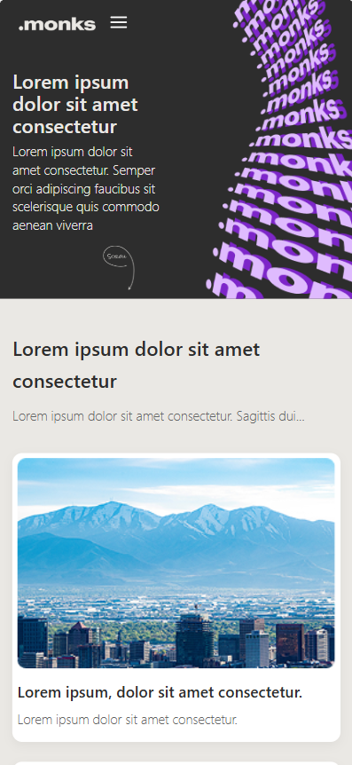

# 🚀 Monks Landing Page - Front-end Challenge


> Projeto de estudo focado em recriar uma interface moderna, responsiva e interativa, baseado no case da Monks.

### 🔗 [Acesse o Projeto Online (GitHub Pages)](https://jean-saraiva03.github.io/CASE-MONKS-2025/)

---

## 📸 Visualização

### Desktop


### Mobile


---

## 🛠️ Tecnologias Utilizadas

* **HTML5 Semântico:** Estruturação organizada do conteúdo (`header`, `main`, `section`, `footer`, `nav`).
* **CSS3 Moderno:**
    * **Flexbox:** Para alinhamentos e distribuição de espaço (menus, centralização).
    * **CSS Grid:** Essencial para o layout assimétrico da galeria e grids de cards responsivos.
    * **Media Queries:** Garantia de responsividade total (Mobile First -> Desktop).
    * **Variáveis CSS:** Para gerenciamento consistente de cores e fontes.
* **JavaScript (Vanilla):**
    * Lógica do **Menu Hambúrguer** (Mobile).
    * Sistema de **Captcha Matemático** funcional no formulário.

---

## 📱 Estratégias de Desenvolvimento

### 1. Mobile-First 📲
O desenvolvimento começou focado em dispositivos móveis. Isso garantiu que o site fosse leve e funcional na menor tela possível. O CSS base é todo mobile, e as `Media Queries (min-width: 768px)` adicionam a complexidade necessária para tablets e desktops.

### 2. Grid Layout Assimétrico 📐
Um dos desafios foi a seção de galeria de imagens. Utilizei `grid-template-rows` e `span` para criar um layout onde a imagem principal ocupa a altura de duas células, enquanto as outras se alinham lateralmente, mantendo a semântica do HTML limpa.

### 3. Interatividade & UX ⚡
* **Validação de Captcha:** Implementação de um script que gera números aleatórios e valida a soma inserida pelo usuário, exibindo um alerta de sucesso ou erro sem recarregar a página desnecessariamente.
* **Navegação:** O menu mobile se transforma completamente no desktop, escondendo o botão hambúrguer e exibindo os links inline.

---

## 📂 Como rodar o projeto localmente

1.  Clone o repositório:
    ```bash
    git clone [https://github.com/Jean-Saraiva03/CASE-MONKS-2025.git](https://github.com/Jean-Saraiva03/CASE-MONKS-2025.git)
    ```
2.  Entre na pasta do projeto:
    ```bash
    cd CASE-MONKS-2025
    ```
3.  Abra o arquivo `index.html` no seu navegador ou use uma extensão como o **Live Server** no VS Code.

---

## 📬 Autor

Feito por **Jean Saraiva**

* [GitHub](https://github.com/Jean-Saraiva03)
* [LinkedIn](https://www.linkedin.com/in/jean-saraiva/) ```
